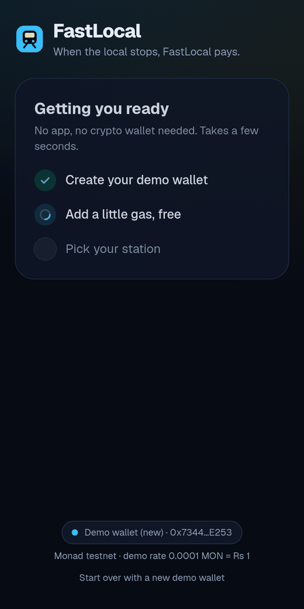
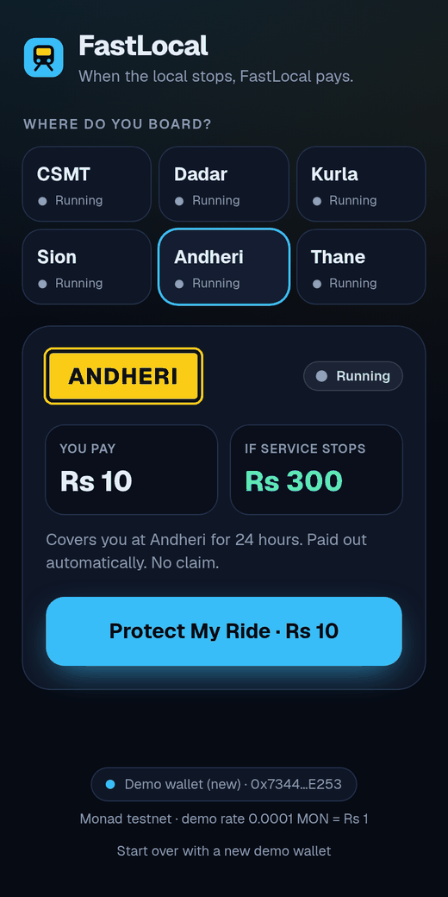
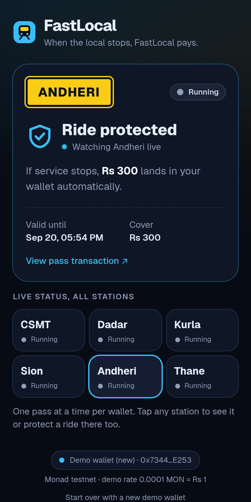
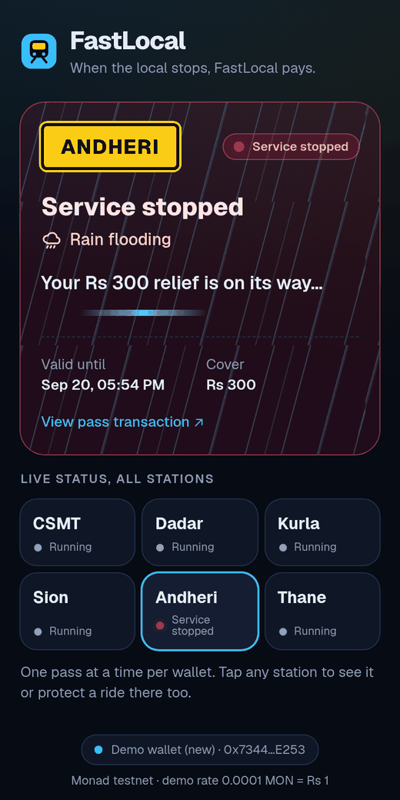
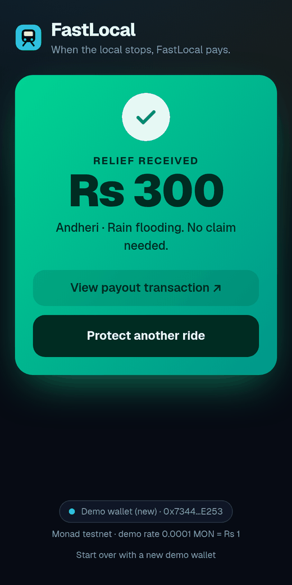
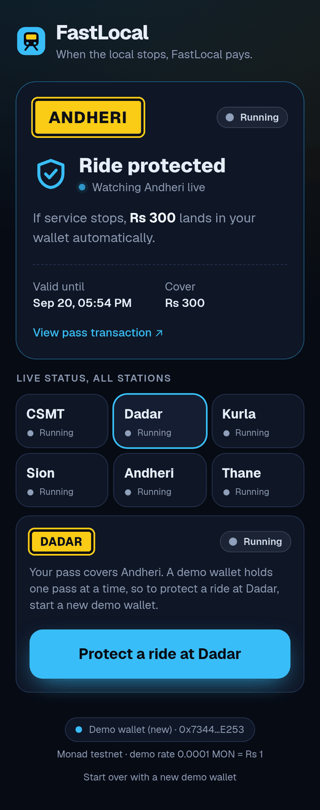
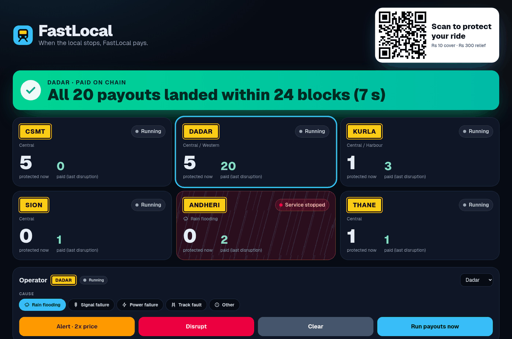

# FastLocal

**When the local stops, FastLocal pays.**

Instant disruption cover for Mumbai local train commuters. Tap once to protect your ride for Rs 10. If your station stops (rain flooding, signal, power or track fault), an autonomous agent pays you Rs 300 on Monad within seconds. No app, no crypto wallet, no claim form.

| | |
|---|---|
| **Live app (phone)** | https://web-amber-seven-021mzgehda.vercel.app |
| **Operator screen** | https://web-amber-seven-021mzgehda.vercel.app/screen (admin passcode) |
| **Smart contract** | [`0xB3b7ca84934aB1F2655179349452E9183e5D4C60`](https://testnet.monadvision.com/address/0xB3b7ca84934aB1F2655179349452E9183e5D4C60) on Monad Testnet (chain 10143), source verified |
| **Repo** | https://github.com/SudoMayo/FastLocal |

## Screenshots

| 1. Setup, no app needed | 2. Pick a station | 3. Ride protected |
|:---:|:---:|:---:|
|  |  |  |
| **4. Rain stops the train** | **5. Paid automatically** | **6. Switch station** |
|  |  |  |

**Operator screen** (for the projector): QR code, live station tiles, cause controls, and the on-chain speed proof.



## The problem

- Mumbai's local trains carry millions of people a day, and service stops often: rain flooding in the monsoon; signal, power and track faults all year.
- A stopped train means an expensive auto or cab, or a lost day of wages.
- Insurance can't handle a Rs 300 loss. The paperwork costs more than the claim, and payment takes days. Relief is needed on the platform, now.

## How it works

1. **Scan.** The commuter scans the QR code. The site creates a demo wallet in the browser and drips a little free gas to it.
2. **Protect.** They pick a station and tap **Protect My Ride**. The pass is bought on chain: Rs 10 normally, 2x during a risk alert (such as heavy rain), and sales close when service stops.
3. **Disruption.** The operator (oracle) marks the station **Service stopped** with a cause. The cause is stored on chain.
4. **Autonomous payout.** An agent watches the chain, sees unpaid passes at the stopped station, and pays them. Nobody presses "pay".
5. **Relief.** The phone turns green: **Rs 300 relief received**, with the transaction link.

## Try the live demo

1. Open the [live app](https://web-amber-seven-021mzgehda.vercel.app) on your phone and wait a few seconds for setup.
2. Pick a station and tap **Protect My Ride · Rs 10**.
3. The operator opens [`/screen`](https://web-amber-seven-021mzgehda.vercel.app/screen), picks your station and a cause, and presses **Disrupt**.
4. Watch your phone: **Service stopped**, then **Rs 300 relief received**.

Automatic payouts need the agent running (`npm run agent`) on the operator's machine. If it isn't running, the screen's **Run payouts now** button pays everyone instead.

## Run it yourself

You need about 10 minutes and some free testnet MON.

| Tool | Version | Install |
|---|---|---|
| Node.js | 20 or newer | https://nodejs.org |
| Foundry (forge, cast) | 1.8 or newer | `curl -L https://foundry.paradigm.xyz \| bash && foundryup` |
| git | any | https://git-scm.com |

### 1. Clone and install

```bash
git clone https://github.com/SudoMayo/FastLocal.git
cd FastLocal
cd web && npm install && cd ..
```

### 2. Create wallets and config

```bash
./scripts/setup.sh
```

This creates 4 wallets and fills in `contracts/.env` and `web/.env.local`. Keys are saved only in gitignored files and are never printed. It shows the wallet addresses:

| Wallet | Job |
|---|---|
| DEPLOYER | Deploys the contract; also the oracle that marks stations stopped |
| RELAYER | Sends free gas to new phones |
| AGENT_WORKER | The autonomous agent that pays out |
| AGENT_SERVER | Backup payouts from the "Run payouts now" button |

### 3. Get testnet MON

Send about **25 testnet MON** to the **DEPLOYER** address from https://faucet.monad.xyz.

Why 25: 3 MON funds the payout vault, 14 MON funds the relayer, and the agents get 4.5 MON. The relayer needs more than 10 MON because Monad keeps a 10 MON reserve on every wallet that sends value.

On a small budget (about 13 MON), set `VAULT_FUND_MON=0.5` in `contracts/.env` and run step 4 as:
`RELAYER_FUND_MON=10.7 AGENT_WORKER_FUND_MON=0.5 AGENT_SERVER_FUND_MON=0.3 ./scripts/deploy-testnet.sh`

### 4. Deploy the contract

```bash
./scripts/deploy-testnet.sh
```

This deploys `FastLocalCore` to Monad Testnet, verifies the source on MonadVision, funds the relayer and agents, and writes the contract address into `web/.env.local`.

### 5. Start the app and the agent

```bash
# Terminal 1: the web app
cd web && npm run dev          # http://localhost:3000

# Terminal 2: the autonomous agent
cd web && npm run agent
```

### 6. Try it

1. Open http://localhost:3000 and tap **Protect My Ride**. To use your phone on the same wifi, open `http://<your-computer-ip>:3000`.
2. Open http://localhost:3000/screen and enter the passcode (`grep ADMIN_PASSCODE web/.env.local`).
3. Pick the same station and a cause, and press **Disrupt**. The agent logs something like `[agent] Dadar DISRUPTED (Rain flooding): 1 eligible -> paid 1`, and the phone turns green.
4. Press **Clear** to reset.

Extras:

```bash
cd contracts && forge test                 # 27 contract tests
cd web && npm run seed -- --count 20 --station 1   # 20 test wallets buy passes at Dadar
```

### Troubleshooting

| You see | Fix |
|---|---|
| "Gas drip is empty" on the phone | The relayer is at or below 10 MON. Send it more MON from DEPLOYER. |
| Phone stuck on "relief is on its way" | The agent isn't running. Start `npm run agent`, or press **Run payouts now** on the screen. |
| "The network is busy right now" | The public RPC is rate limiting. Wait a few seconds, or set `RPC_URL` and `NEXT_PUBLIC_RPC_URL` to a private Monad RPC. |
| `setup.sh` says setup is already done | Delete `.secrets/`, `contracts/.env` and `web/.env.local` to start over. |
| Health panel warns about the vault | The vault can't cover all protected passes. Send MON to the contract address. |

<details>
<summary>Manual steps (without the scripts)</summary>

```bash
# Wallets: run 4 times; cast prints the address and private key
cast wallet new

# contracts/.env: DEPLOYER_PRIVATE_KEY, AGENT_WORKER_ADDRESS, AGENT_SERVER_ADDRESS, VAULT_FUND_MON
cd contracts
set -a; source .env; set +a
forge script script/Deploy.s.sol:Deploy --rpc-url monad_testnet --broadcast --slow --gas-estimate-multiplier 130
forge verify-contract <CONTRACT> src/FastLocalCore.sol:FastLocalCore --chain 10143 \
  --verifier sourcify --verifier-url https://sourcify-api-monad.blockvision.org/

# Fund helpers (explicit gas limit; Monad charges the full limit)
cast send <RELAYER> --value 14ether --gas-limit 21000 --private-key $DEPLOYER_PRIVATE_KEY --rpc-url https://testnet-rpc.monad.xyz
cast send <AGENT_WORKER> --value 3ether --gas-limit 21000 --private-key $DEPLOYER_PRIVATE_KEY --rpc-url https://testnet-rpc.monad.xyz
cast send <AGENT_SERVER> --value 1.5ether --gas-limit 21000 --private-key $DEPLOYER_PRIVATE_KEY --rpc-url https://testnet-rpc.monad.xyz

# web/.env.local: copy web/.env.example and fill it in (table below)
```

</details>

## Deploy on Vercel

1. Import the repo on vercel.com and set **Root Directory** to `web`.
2. Under **Environment Variables**, add the variables below. Tip: **Import .env** accepts a file, so paste only these lines from `web/.env.local`.
3. Click **Deploy**. `/` is the phone app, and `/screen` is the operator screen.
4. Keep `npm run agent` running on the operator's machine for automatic payouts.

| Variable | Secret | Value |
|---|---|---|
| `NEXT_PUBLIC_CONTRACT_ADDRESS` | no | your contract address |
| `NEXT_PUBLIC_RPC_URL` | no | `https://testnet-rpc.monad.xyz` |
| `NEXT_PUBLIC_EXPLORER_URL` | no | `https://testnet.monadvision.com` |
| `NEXT_PUBLIC_CHAIN_ID` | no | `10143` |
| `RPC_URL` | no | `https://testnet-rpc.monad.xyz` |
| `AGENT_WORKER_ADDRESS` | no | from `setup.sh` |
| `DRIP_AMOUNT_MON` | no | `0.065` |
| `ORACLE_PRIVATE_KEY` | **yes** | DEPLOYER key |
| `RELAYER_PRIVATE_KEY` | **yes** | RELAYER key |
| `AGENT_SERVER_PRIVATE_KEY` | **yes** | AGENT_SERVER key |
| `ADMIN_PASSCODE` | **yes** | operator passcode |

Never add `AGENT_WORKER_PRIVATE_KEY` to Vercel; it's for the local agent only. If you redeploy the contract, update `NEXT_PUBLIC_CONTRACT_ADDRESS` on Vercel and redeploy.

## Under the hood

```
 Phone (browser)                         Operator screen (/screen)
 demo wallet in localStorage             station + cause controls, QR,
 buys the pass itself                    live counts, health, speed proof
      |          \                              |
      | reads     \ POST /api/drip              | POST /api/admin/station  (oracle key)
      |            v                            v POST /api/admin/payout   (backup payouts)
      |      +------------------ Next.js on Vercel ------------------+
      |      |  gas drip for new wallets, health, admin routes       |
      |      +--------------------------+----------------------------+
      v                                 v
 +------------------------- Monad: FastLocalCore.sol -------------------------+
 |  station status + cause  |  passes (1 storage slot each)  |  payout vault   |
 +----------------------------------------------------------------------------+
      ^
      | every 2 s: find stopped stations with unpaid passes, pay them
 Autonomous agent (npm run agent, runs on the operator's machine)
```

**Autonomous agent** (`web/scripts/agent.ts`, `web/lib/server/payout-engine.ts`):
- **Loop:** every 2 s it reads all stations. For each stopped station with unpaid passes, it sends `payout()` transactions in parallel bursts, then retries anything missed with `payoutBatch`.
- **Restart-safe:** all state lives on chain, and the contract refuses double payouts.
- **Resilient:** it keeps running through RPC outages and warns when its gas is low.
- **Safe to race:** the backup button uses a separate key and `payoutBatch`, which skips already-paid passes, so both can run at once without paying twice.

**Contract** (`contracts/src/FastLocalCore.sol`):

| Function | Who | What |
|---|---|---|
| `buyPass(stationId)` | anyone | Buy a 24-hour pass. One active pass per wallet. |
| `premiumFor(stationId)` | anyone | Rs 10 base, 2x on alert, reverts when service is stopped |
| `setStation(id, status, cause)` | oracle | Running / risk alert / service stopped, with a cause |
| `payout(addr)`, `payoutBatch(addrs)` | agents | Pay eligible passes; the batch skips ineligible ones and survives failed transfers |
| `getAllStatuses`, `getSnapshot`, `vaultCoverage` | anyone | Read-only views for the app |
| `setAgent`, `setPremium`, `setPayout`, `setSalesOpen`, `withdraw`, … | owner | Admin |

Causes: rain flooding, signal failure, power failure, track fault, other. Every cause pays the same relief. Amounts use a demo rate of 0.0001 MON = Rs 1.

## Measured on Monad Testnet

| Run | Result |
|---|---|
| Agent, Dadar, rain flooding, 21 passes | 21 of 21 paid within 8 blocks of each other; **24 blocks (7 s)** from the disruption block to the last payout |
| Backup `payoutBatch`, Kurla, 3 passes | 3 of 3 paid in one tx, **12 blocks (3 s)** after the disruption |
| Agent, Sion, rain flooding (phone flow) | Paid **14 blocks (4 s)** after the disruption |
| Gas per call (limit = estimate × 1.3) | `buyPass` 185k to 207k, `payout` 108k, `payoutBatch` about 49k per address |

Seconds come from block timestamps (1 s resolution). Monad charges the full gas limit, so every write sets an explicit, tight limit.

## Edge cases handled

- **Station already stopped:** "Sales closed at {station}", and the contract rejects the buy.
- **Price changes mid-tap** (alert just started): the tx reverts, and the phone asks for one more tap at the new price.
- **Double tap or two tabs:** the second buy is rejected; the phone shows the protected pass.
- **Page reload during setup:** the drip isn't sent twice, and the wallet persists.
- **One pass per wallet:** tap any station and use **Protect a ride at {station}** to start a new demo wallet.
- **Disruption at another station:** your pass isn't paid and stays protected.
- **Expired or paid pass:** buy again.
- **Vault too low:** payouts pause, the health panel warns, and the next cycle pays once the vault is funded.
- **Early reset:** Clear is blocked while passes are still unpaid, unless forced.
- **A recipient rejects payment:** the batch restores that pass and keeps paying the rest.
- **Busy RPC:** setup retries with backoff; errors are short and readable.

## Limitations and next steps

- **Single operator as oracle.** Next: combine rail service status, live rainfall data and verified commuter reports.
- **Testnet MON at a demo rate.** Next: stablecoin payouts, a UPI off-ramp and a Monad Mainnet deploy.
- **No per-station coverage cap yet.** Next: cap passes by vault size.
- **Demo wallets live in the browser.**
- **The agent runs on one machine.**

## Business model

- **Revenue:** a premium pool with a target loss ratio; B2B cover for employers and gig platforms; brand-sponsored free passes; disruption data.
- **Year-round demand:** rain in the monsoon; signal, power and track faults all year.
- **Go-to-market:** 3 high-disruption stations, 1 employer partner, and a licensed insurance partner or a sponsored-relief model.
- **Traction so far:** 51 wallets bought passes on Monad Testnet during the event, mostly our own test and demo wallets. A commuter survey is the next step.

## Repo layout

```
contracts/          Foundry: src/FastLocalCore.sol, test/, script/Deploy.s.sol
web/app/            phone page, /screen operator page, API routes (drip, health, admin)
web/components/     shared UI pieces (station board, status pill, icons)
web/lib/            config, ABI, contract reads, client helpers, payout engine
web/scripts/        agent.ts (autonomous worker), seed.ts (load test)
scripts/            setup.sh (wallets + config), deploy-testnet.sh (deploy, verify, fund)
docs/               PRD and screenshots
```

## Team

Built at Monad Blitz Mumbai V4 by **Anshul Yadav** and **Mrudula Jadhav**.
